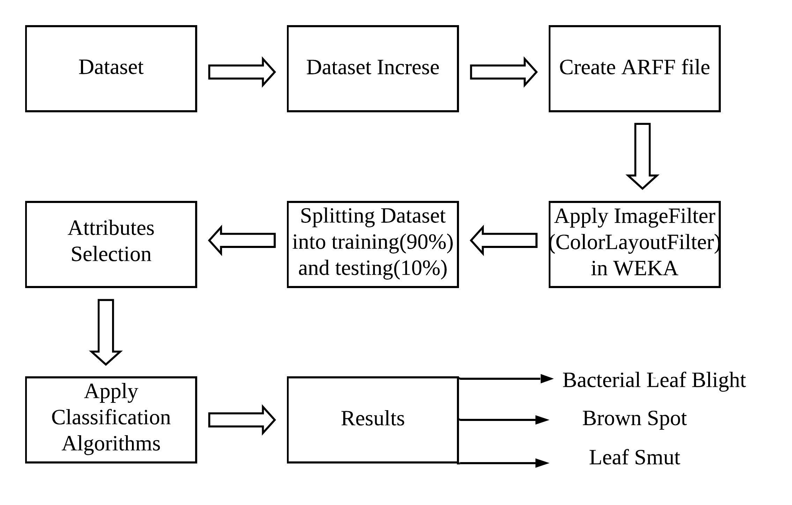

# Rice Leaf Disease Detection
As one of the top ten rice producing and consuming countries in the world, Bangladesh depends greatly on rice for its
economy and for meeting its food demands. To ensure healthy and proper growth of the rice plants it is essential to detect
any disease in time and prior to applying required treatment to the affected plants. Since manual detection of diseases costs a
large amount of time and labour, it is inevitably prudent to have an automated system. This paper presents a rice leaf disease
detection system using machine learning approaches. Three of the most common rice plant diseases namely leaf smut, bacterial
leaf blight and brown spot diseases are detected in this work. Clear images of affected rice leaves with white background were
used as the input. After necessary pre-processing, the dataset was trained on with a range of different machine learning algorithms
including that of KNN(K-Nearest Neighbour), J48(Decision Tree), Naive Bayes and Logistic Regression. Decision tree algorithm,
after 10-fold cross validation, achieved an accuracy of over 97% when applied on the test dataset.

Technologies used:
  - Weka
  - Python
  - Machine Learning 
  - Pandas
  - Sklearn

The comparison between the accuracy of the four classification algorithms are represented in the Figure.

 
A comparison between four machine learning algorithms (including that of KNN, Decision tree, Logistic regression and Naive Bayes) in the realms of rice leaf disease detection has been made. The algorithms predicted the rice leaf diseases with varying degrees of accuracy. It was found that decision tree performed the best with 97.9167% accuracy on test data. Having thus identified a near-optimal algorithm, we hope to extend this study further as higher quality datasets become available in the future.
For our future work, we plan to explore the effectiveness of deep learning and transfer learning methods on this dataset.
License
----

